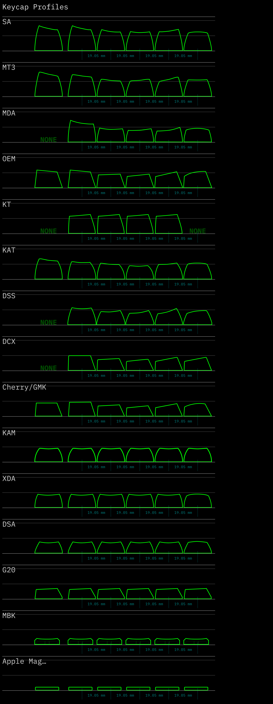

#+title: Keycap Profile Deep Dive: From Cherry to MT3
#+author: SOV710
#+date: 2026-03-23 07:16:25
#+description: 

* 键帽高度标准: 为什么你的手感总是差一点

键帽的 *profile* (型材) 决定了键盘的打字手感、视觉美学和人体工学特性。不同的 profile 在高度、弧度、雕刻程度上有巨大差异——从 Cherry 的低矮雕刻, 到 SA 的高耸球面, 再到 XDA 的完全平坦, 每种都有自己的哲学。

本文深入剖析主流键帽 profile 的几何参数、设计理念和实际手感, 面向已经入坑但还在探索 "完美手感" 的 keyboard geek。

#+ATTR_ORG: :width 400

* 核心概念: Sculpted vs Uniform

在讨论具体 profile 前, 先理解两个基本概念。

** Sculpted Profile (雕刻式)

*不同行 (row) 的键帽高度和角度不同*, 模拟手指的自然弧线。

- *R1* (数字行): 最高, 向后倾斜
- *R2* (QWERTY 行): 次高
- *R3* (ASDF 行, Home Row): 中等高度, 接近水平
- *R4* (ZXCV 行): 较低, 向前倾斜
- *Space Row*: 最低或特殊造型

典型代表: *Cherry*, *OEM*, *SA*, *MT3*

优势:
- 符合人体工学, 手指自然下落角度
- 减少手腕疲劳
- 盲打更准确 (通过高度差定位 Home Row)

劣势:
- 键帽不能随意互换 (每行高度不同)
- 定制布局困难 (如 40% 键盘、split 键盘)
- 库存管理复杂 (厂商需要生产多套模具)

** Uniform Profile (均匀式)

*所有键帽高度和角度完全相同* (除了空格等特殊键)。

典型代表: *DSA*, *XDA*, *KAM*

优势:
- 键帽可以随意互换位置
- 适合非标布局 (Ortholinear, Ergo split, 40%)
- 库存简单 (只需一套模具)

劣势:
- 缺乏人体工学支持
- 手指需要适应完全平坦的表面
- 盲打定位依赖触觉点 (F/J 上的凸起)

* Cherry Profile: 低调的王者

Cherry profile 是 *最经典* 的雕刻式键帽, 由德国 Cherry 公司在 1980 年代设计, 至今仍是高端定制键帽的黄金标准。

[[https://i.imgur.com/8tKLq3V.png]]

** 几何参数

各行高度 (从桌面到键帽顶部中心):

- R1: ~12.5 mm
- R2: ~11.5 mm
- R3: ~10.5 mm (Home Row)
- R4: ~11.0 mm
- Space: ~8.5 mm

*总高度跨度*: ~4 mm (R1 到 Space)

倾斜角度:
- R1: ~7° 向后倾斜
- R2: ~3° 向后
- R3: ~0° (接近水平)
- R4: ~5° 向前倾斜

键帽顶面: *圆柱形弧面* (cylindrical), 弧度较浅, 手感类似 "缓坡"。

** 设计理念

Cherry 的设计哲学是 *低矮 + 紧凑*:

1. *总高度低*: R3 只有 10.5 mm, 相比 SA 的 ~16 mm 低了 35%。
2. *弧度浅*: 顶面几乎是平的, 手指接触面积大。
3. *行间高度差小*: 只有 2 mm, 过渡平滑。

这带来的手感是:
- *快速打字友好*: 手指移动距离短
- *低疲劳*: 手腕不需要抬太高
- *精准*: 键帽间隙小, 误触少

** 适用人群

- 程序员 / 文字工作者 (长时间打字)
- 喜欢低矮手感的玩家
- 使用标准 ANSI/ISO 布局

*不适合*:
- 喜欢 "敲击感" 的机械键盘玩家 (太低矮)
- 非标布局用户 (雕刻式难以兼容)

** 代表键帽

- *GMK* (德国原厂 ABS 双色)
- *ePBT* (国产 PBT 热升华)
- *CRP* (Cherry 原厂 ABS)

* OEM Profile: 最常见但最平庸

OEM profile 是 *市面上最常见* 的键帽型材, 几乎所有廉价成品键盘都用它。

** 几何参数

各行高度:

- R1: ~14.5 mm
- R2: ~12.5 mm
- R3: ~11.5 mm
- R4: ~12.0 mm
- Space: ~9.5 mm

*比 Cherry 高约 1~2 mm*​。

倾斜角度: 类似 Cherry, 但 R1 倾斜更明显 (~10°)。

键帽顶面: *圆柱形弧面*, 弧度比 Cherry 稍深。

** 设计理念

OEM 是 Cherry 的 *廉价仿制版*, 为了降低成本而牺牲了一些精度:

1. *模具简化*: 高度差更大, 模具更容易开
2. *材料节省*: 壁厚不均匀, ABS 用量少
3. *兼容性优先*: 适配各种轴体 (Cherry MX, Outemu, Gateron...)

结果是手感 *中庸*:
- 既不像 Cherry 那么精致
- 也不像 SA 那么有特色
- 就是... 能用

** 为什么它这么流行?

- *成本低*: 模具便宜, 量产简单
- *兼容性好*: 适配各种轴体和布局
- *用户熟悉*: 大部分人的第一把机械键盘就是 OEM

但对于追求手感的玩家, OEM 通常是 *第一个被淘汰* 的选择。

** 代表键帽

- *Tai-Hao* (彩虹键帽)
- *HyperX* (成品键盘附带)
- *大部分淘宝/京东 100 元以下的键帽*

* SA Profile: 复古高球面

SA (Spherical All) 是 *最高* 的键帽 profile, 源自 1970 年代的打字机键帽设计, 带有强烈的复古美学。

[[https://i.imgur.com/kN9Xm3p.png]]

** 几何参数

各行高度:

- R1: ~16.5 mm
- R2: ~14.5 mm
- R3: ~13.5 mm
- R4: ~13.0 mm
- Space: ~11.0 mm

*比 Cherry 高约 30~40%*!

倾斜角度: 类似 Cherry, 但由于高度高, 倾斜感更明显。

键帽顶面: *球面* (spherical), 不是圆柱面! 弧度很深, 手感像 "碗"。

** 设计理念

SA 的设计哲学是 *高耸 + 球面 + 复古*:

1. *高度高*: 提供强烈的 "敲击感"
2. *球面*: 手指接触更精准, 定位清晰
3. *复古*: 致敬 IBM Selectric 打字机

这带来的手感是:
- *仪式感强*: 每次按键都有明确的反馈
- *声音响亮*: 高度高, 回弹声更清脆
- *容易疲劳*: 手指移动距离长

** Sculpted SA vs Uniform SA

SA 有两种版本:

1. *SA Sculpted* (R1-R4): 传统雕刻式
2. *SA R3* (全键盘都是 R3 高度): 均匀式

SA R3 是妥协方案, 保留了高度和球面, 但牺牲了雕刻。

** 适用人群

- 复古爱好者 (视觉优先)
- 喜欢高键帽的玩家
- 不在意疲劳的轻度使用者

*不适合*:
- 长时间打字 (太高, 手腕累)
- FPS 游戏玩家 (反应速度慢)

** 代表键帽

- *Signature Plastics SA* (美国原厂)
- *MaxKey SA* (国产仿制)
- *RAMA SA* (高端定制)

* DSA Profile: 低矮球面均匀式

DSA (DCS Spherical All) 是 *最受欢迎* 的均匀式 profile, 兼顾了低矮和球面手感。

** 几何参数

*所有键帽高度相同*: ~7.4 mm (从桌面到顶部)

键帽顶面: *球面*, 弧度适中。

*比 Cherry R3 低约 3 mm*, 是所有主流 profile 中最低的。

** 设计理念

DSA 的设计哲学是 *低矮 + 球面 + 灵活*:

1. *低矮*: 手指移动距离短
2. *球面*: 保留定位感
3. *均匀*: 所有键可互换

这带来的手感是:
- *快速打字*: 低矮且平滑
- *灵活布局*: 适合 Ortholinear, Ergo split, 40%
- *适应期短*: 没有雕刻的 "束缚感"

** 适用人群

- 非标布局用户 (Planck, Ergodox, Corne...)
- 喜欢低矮手感的玩家
- 需要频繁更换键帽位置的玩家

*不适合*:
- 依赖雕刻定位的盲打者
- 喜欢高键帽的玩家

** 代表键帽

- *Signature Plastics DSA* (美国原厂)
- *KBDfans DSA* (国产)
- *YMDK DSA* (彩色套装)

* XDA Profile: 完全平坦的激进方案

XDA 是 DSA 的 *平面版本*, 彻底抛弃了球面, 追求极致的 "平"。

** 几何参数

*所有键帽高度相同*: ~8.5 mm

键帽顶面: *完全平坦* (flat), 没有任何弧度。

*比 DSA 高约 1 mm, 但比 Cherry 低约 2 mm*​。

** 设计理念

XDA 的设计哲学是 *激进的简化*:

1. *完全平坦*: 手指接触面积最大
2. *均匀*: 所有键可互换
3. *视觉简洁*: 顶面是纯平的正方形

这带来的手感是:
- *手指放松*: 不需要 "找" 球面的中心
- *声音低沉*: 平面接触面积大, 回弹声闷
- *适应期长*: 完全没有定位参考

** 适用人群

- 极简主义者
- Ortholinear 布局用户
- 不在意定位感的玩家

*不适合*:
- 盲打依赖触觉的玩家
- 喜欢 "敲击感" 的玩家

** 代表键帽

- *KBDfans XDA* (最早推广 XDA 的厂商)
- *Domikey XDA* (国产高端)
- *NP Profile* (XDA 的变种, 顶面稍有弧度)

* MT3 Profile: 新时代的高雕刻

MT3 (Modern Typing 3) 是 Matt3o 设计的 *现代高雕刻* profile, 试图结合 SA 的高度和 Cherry 的人体工学。

** 几何参数

各行高度:

- R1: ~16.0 mm
- R2: ~13.5 mm
- R3: ~12.0 mm
- R4: ~12.5 mm
- Space: ~9.5 mm

*与 SA 相近, 但行间高度差更大*​。

键帽顶面: *深碗状球面*, 弧度比 SA 更深!

** 设计理念

MT3 的设计哲学是 *高雕刻 + 深碗 + 打字机复古*:

1. *深碗*: 手指 "陷入" 键帽, 定位极其精准
2. *高雕刻*: R1 到 R4 高度差达 4 mm
3. *厚壁*: 键帽壁厚 1.5~2 mm, 声音低沉

这带来的手感是:
- *定位极准*: 手指自动 "卡" 在碗中心
- *声音厚重*: 类似打字机的 "咔哒" 声
- *严重分化*: 要么极度喜欢, 要么完全不适应

** 适用人群

- 打字机复古爱好者
- 追求极致定位的盲打者
- 不在意高度的玩家

*不适合*:
- 游戏玩家 (高度太高, 反应慢)
- 手小或手腕敏感的用户

** 代表键帽

- *Drop MT3* (官方授权)
- *Domikey MT3* (国产高端)
- *Osume MT3* (日系主题)

* KAT/KAM Profile: 中庸的妥协方案

KAT (Keyreative All Touch) 和 KAM (Keyreative All Material) 是国产厂商 Keyreative 推出的 *中等高度* profile。

** 几何参数

*KAT* (雕刻式):

- R1: ~13.0 mm
- R2: ~11.5 mm
- R3: ~10.5 mm
- R4: ~11.0 mm

*介于 Cherry 和 OEM 之间*​。

*KAM* (均匀式):

- 所有键高度相同: ~11.0 mm
- *介于 DSA 和 XDA 之间*​。

键帽顶面: *浅球面*, 弧度比 DSA 浅。

** 设计理念

KAT/KAM 的设计哲学是 *兼容并蓄*:

1. *高度适中*: 不像 SA 那么高, 不像 DSA 那么低
2. *弧度适中*: 不像 MT3 那么深, 不像 XDA 那么平
3. *材料创新*: 使用 PBT 双色 (传统是 ABS)

这带来的手感是:
- *中庸*: 适合大多数人
- *声音清脆*: PBT 材质的特性
- *没有明显短板*: 也没有明显亮点

** 适用人群

- 第一次尝试非 OEM profile 的玩家
- 不确定自己喜欢什么的用户
- 预算有限但想要 PBT 的玩家

** 代表键帽

- *Keyreative KAT* (官方)
- *Keyreative KAM* (官方)

* Profile 对比总结

** 高度排序 (R3 行)

从低到高:

1. *DSA*: 7.4 mm (最低)
2. *XDA*: 8.5 mm
3. *Cherry*: 10.5 mm
4. *KAT*: 10.5 mm
5. *KAM*: 11.0 mm
6. *OEM*: 11.5 mm
7. *MT3*: 12.0 mm
8. *SA*: 13.5 mm (最高)

** 雕刻程度排序

从平坦到雕刻:

1. *XDA*: 完全均匀
2. *DSA*: 均匀球面
3. *KAM*: 均匀浅球面
4. *Cherry*: 低矮雕刻
5. *KAT*: 中等雕刻
6. *OEM*: 中等雕刻
7. *SA*: 高雕刻球面
8. *MT3*: 深碗高雕刻 (最雕刻)

** 打字速度友好度

从快到慢:

1. *Cherry* (低矮 + 浅弧度)
2. *DSA* (低矮 + 均匀)
3. *XDA* (平坦 + 均匀)
4. *KAT* (中等高度)
5. *OEM* (中等高度)
6. *KAM* (中等均匀)
7. *SA* (高键帽)
8. *MT3* (深碗, 适应期长)

** 布局灵活性

从灵活到僵化:

1. *XDA/DSA/KAM* (均匀式, 完全灵活)
2. *SA R3* (均匀高球面)
3. *Cherry/OEM/KAT/SA/MT3* (雕刻式, 需要对应行号)

** 声音特性

- *高亢清脆*: SA, MT3 (高键帽 + 厚壁)
- *中性*: Cherry, OEM, KAT
- *低沉闷响*: XDA, DSA (低矮 + 平面)

* 选择建议: 场景驱动

| 使用场景             | 推荐 Profile                | 理由                  |
|------------------+---------------------------+---------------------|
| 长时间编程/写作       | Cherry, KAT               | 低矮, 手腕不累            |
| 游戏 (FPS/MOBA)    | Cherry, DSA               | 快速反应, 低延迟           |
| 非标布局 (40%, split) | DSA, XDA, KAM             | 均匀式, 键帽可互换          |
| 视觉优先/收藏         | SA, MT3                   | 高大威猛, 复古美学          |
| 盲打定位依赖          | MT3, Cherry               | 深碗或浅雕刻, 触觉明确        |
| 第一次尝试非 OEM      | KAT, DSA                  | 中庸, 容错率高            |
| 极简主义             | XDA                       | 完全平坦, 视觉纯粹          |
| 打字机复古情怀         | MT3, SA                   | 高键帽 + 深碗, 致敬经典      |

* 实际测量与验证

** 如何测量键帽高度

使用 *游标卡尺* (caliper) 测量:

1. *总高度*: 从桌面到键帽顶部中心
2. *键帽本体高度*: 从底部到顶部 (不含轴体高度)
3. *弧度深度*: 从键帽边缘到中心的高度差

*注意*: 不同轴体 (Cherry MX, Kailh, Gateron) 的轴心高度略有差异 (~0.5 mm), 会影响总高度测量。

** 手感测试方法

1. *盲打测试*: 闭眼打一段文字, 记录错误率
2. *速度测试*: 用 TypeRacer/Monkeytype 测 WPM
3. *疲劳测试*: 连续打字 2 小时, 记录手腕/手指疲劳度

*建议*: 至少适应一周再下结论, 初期手感可能有误导性。

* 终极建议

** 如果你是新手

从 *Cherry* 或 *KAT* 开始, 这是最安全的选择。

** 如果你用非标布局

*DSA* 或 *XDA*, 没有其他选择。

** 如果你追求极致手感

买一套 *样品包* (sampler pack), 包含各种 profile 的单个键帽, 亲自试试。

** 如果你是收藏家

*SA* 和 *MT3*, 视觉冲击力最强。

** 最重要的原则

*Profile 是个人偏好, 没有绝对的 "最好"*​。不要听别人说 "Cherry 是王道" 或 "SA 最舒服", 亲自试过才知道。

买键帽前, 先问自己:

1. 我主要用键盘做什么? (打字​/游戏/​收藏)
2. 我的布局是标准的吗? (ANSI/ISO/​非标)
3. 我能接受适应期吗? (MT3 需要 1~2 周)

*然后, 去买样品包, 用手投票。*
